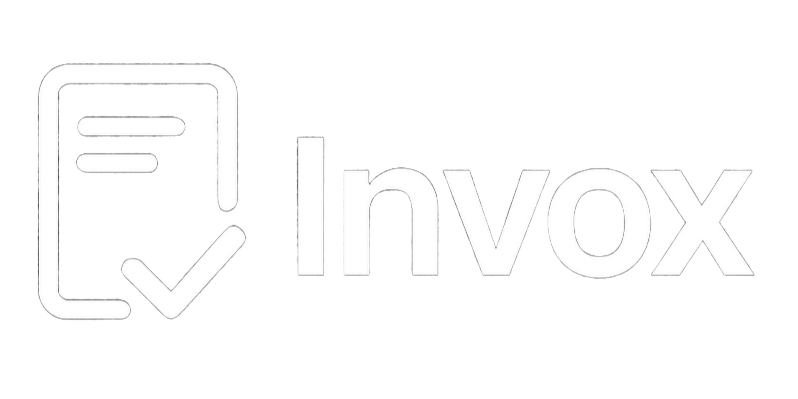

<div align="center">



### Modern Monochromatic Invoice Maker

_A sleek, client-side invoice application with live preview and export capabilities_

<p align="center">
  
  
  
</p>

<p align="center">
  
  
</p>

<p align="center" style="font-weight: bold;">
  <a href="#-quick-start">Quick Start</a> •
  <a href="#-features">Features</a> •
  <a href="#-keyboard-shortcuts">Shortcuts</a> •
  <a href="#-customization">Customize</a>
</p>

</div>

---

## 📖 Overview

**Invox** is a modern invoice maker built entirely in vanilla JavaScript with no framework dependencies. Create, save, and export professional invoices with a monochromatic design, live preview, and instant PDF generation. All data stays in your browser—100% client-side.

---

## ✨ Features

<table>
<tr>
<td width="50%">

### 🎨 Modern Design

- Monochromatic palette with neon cyan accents
- Smooth animations & micro-interactions
- Responsive (mobile → desktop)
- Two templates: Minimal & Professional
- Hover glows & entrance animations

</td>
<td width="50%">

### 📝 Full Invoice Control

- Auto-generated invoice numbers
- Dynamic line items (add/remove)
- Decimal support for quantities
- Tax & discount (% or fixed)
- Live total calculation
- Business & client details

</td>
</tr>
<tr>
<td width="50%">

### 💾 Save & Load

- Store invoices in localStorage
- Name saved versions
- Load/delete with one click
- Browser-based persistence

</td>
<td width="50%">

### 📤 Export & Print

- Print-optimized view (B&W)
- PDF export (html2canvas + jsPDF)
- Clean printable layout
- No glows in print mode

</td>
</tr>
</table>

---

## 🚀 Quick Start

1. **Open** `index.html` in any modern browser (no server needed)
2. **Fill in** business info, client details, and line items
3. **Preview** updates live as you edit
4. **Save** to localStorage or **Export** as PDF
5. **Print** directly to paper with optimized styling

That's it! Pre-loaded with sample data so you see it working immediately.

---

## ⌨️ Keyboard Shortcuts

| Shortcut           | Action             |
| ------------------ | ------------------ |
| `Ctrl+S` / `Cmd+S` | Open save dialog   |
| `Ctrl+P` / `Cmd+P` | Print invoice      |
| `Ctrl+N` / `Cmd+N` | Create new invoice |

---

## 🎨 Customization

Edit CSS variables at the top of `styles.css` to change colors, fonts, and spacing:

```css
:root {
  --color-base: #1a1a2e; /* Dark base color */
  --color-accent: #00d4ff; /* Neon cyan */
  --color-bg: #f8f8fb; /* Light background */
  --color-text: #2a2a3e; /* Text color */
  --font-sans: -apple-system, BlinkMacSystemFont, "Segoe UI", sans-serif;
  --spacing-md: 1rem;
}
```

**Template Switch**: Click the template toggle in the header to switch between Minimal (clean) and Professional (serif) styles.

---

## 🔒 Privacy & Security

✅ **100% Client-Side**: All invoices stored in your browser's `localStorage`

✅ **No Server**: No data sent anywhere

✅ **No Tracking**: Privacy-first by default

**Future**: To add email/cloud sync, integrate your backend API in `app.js` at the `saveToLocalStorage()` function.

---

## 📁 File Structure

| File         | Purpose                                 |
| ------------ | --------------------------------------- |
| `index.html` | Main UI template with form & preview    |
| `styles.css` | Complete responsive design & animations |
| `app.js`     | Invoice logic, calculations, export     |
| `Invox.png`  | App logo                                |
| `README.md`  | This file                               |

---

## 🌐 Browser Support

All modern browsers: Chrome, Firefox, Safari, Edge

Requires:

- ES6+ JavaScript support
- CSS Grid & Flexbox
- `localStorage` API
- HTML5 date inputs

---

## 📄 License

[LICENSE](LICENSE) — See for details.

---

<div align="center">

**Have questions? Check the browser console (F12) for helpful debug logs.**

</div>
